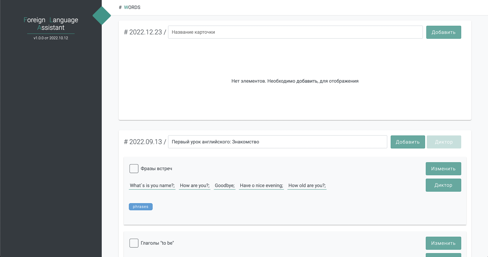
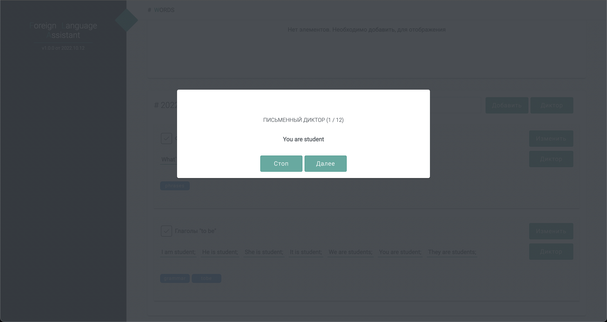
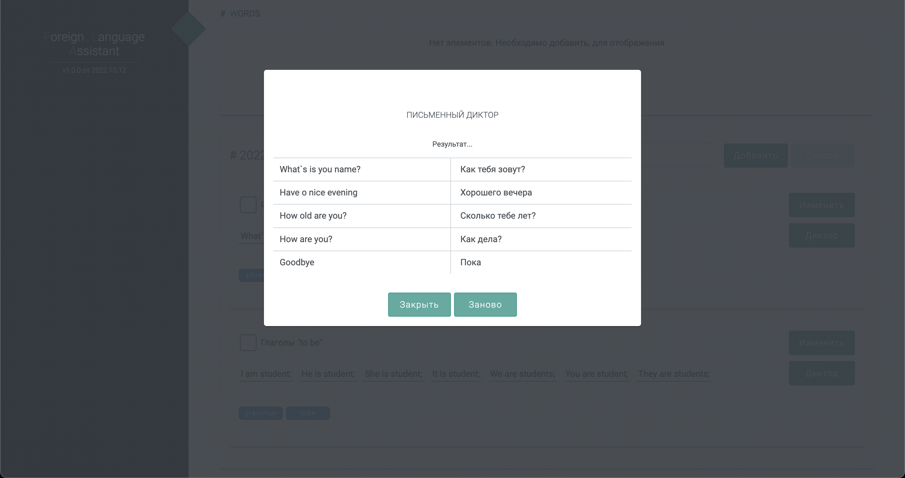

[app]: https://manushovrodion.github.io/foreign-language-assistant/
[wiki]: https://manushovrodion.github.io/foreign-language-assistant/
[issues_type_question]: https://github.com/ManushovRodion/foreign-language-assistant/issues?q=label%3Aquestion+
[issues_type_bug]: https://github.com/ManushovRodion/foreign-language-assistant/labels/bug
[issues_type_suggestion]: https://github.com/ManushovRodion/foreign-language-assistant/issues?q=label%3Asuggestion+
[form_by_client_template_bug]: https://github.com/ManushovRodion/foreign-language-assistant/issues/new?assignees=&labels=client%2Cbug&template=client_bug_report.yml
[form_by_client_template_suggestion]: https://github.com/ManushovRodion/foreign-language-assistant/issues/new?assignees=&labels=client%2Csuggestion&template=client_suggestion.yml
[form_by_client_template_question]: https://github.com/ManushovRodion/foreign-language-assistant/issues/new?assignees=&labels=client%2Cquestion&template=client_question.yml

# foreign-language-assistant

> Это помощник в изучение новых слов/фраз на иностранном языке!

Выступает в качестве того, что хранит в себе удобный набор слов/фраз, которые вы добавили, и в качестве того кто диктует вам эти слова/фразы - на текущий день это похоже на словарик иностранного языка.

- Если нашли ошибку, то: [просмотреть список ошибок][issues_type_bug] или [создать отчет по ошибке][form_by_client_template_bug]
- Если есть вопросы, то: [просмотреть список вопросов][issues_type_question] или [создать вопрос][form_by_client_template_question]
- Если есть предложения, то: [просмотреть список предложений][issues_type_suggestion] или [создать предложение][form_by_client_template_suggestion]
- [Документация][wiki]

## # Функционал

- Добавление слов/фраз на иностранном языке, с возможностью сгруппировать их по определенным свойствам;
<!-- - Фильтрация и сортировка данных; -->
- Диктор(пока в письменном варианте), по всем словам/фразам в вашей базе или по определенным свойствам;
- После диктовки отображает поряд продиктованных слов/фраз и их перевод, который даст вам сравнить правильность написания;
<!-- - Есть бекап данных, посредством выгрузки и загрузки; -->
- Одинаково удобно открывается на декстопе, на планшетах и телефоне(если нет - поправим);

Данный список будет расширяться по возможности.

## # Использование

1. Переходим по [ссылке][app] приложение.
   <!-- 2. Смотрим в [документацию][wiki], если что-то непонятно. -->
   <!-- 3. Добавляем свои слова/фразы или загружаем через бекап. -->
2. Пользуемся.

## # Примечание

Данные не храняться на внешнем устростве, так что за сохранность данных ответственность висит за пользователем.

Если откроете в другом браузере, на другом устройстве или в анонимном режиме браузера - то придется заново заполнять данные(на то и сделан бекап).

## # Планы на будущие

- Мобильное приложение
- Облако для синхронизации устройств
- Голосовой диктор
- Генератор фраз на базе правил языка
